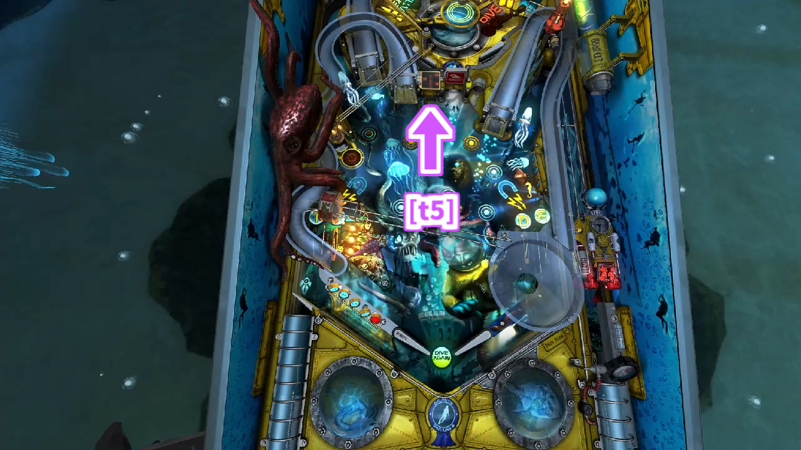
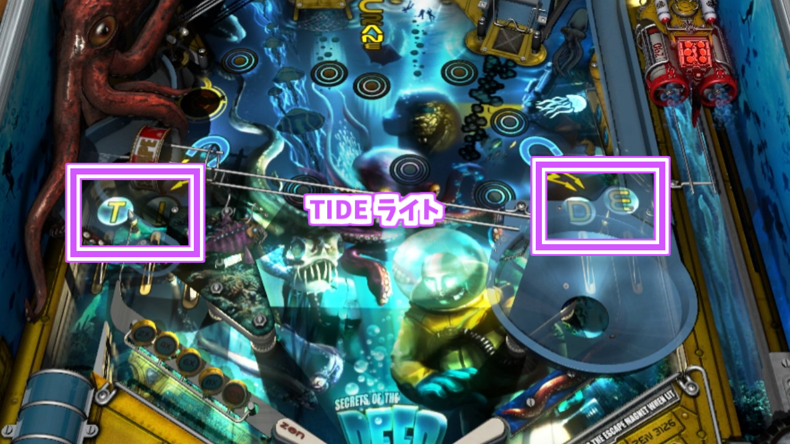

# Secrets of The Deep

## 概要

Secrets of The Deepは深海をイメージしたピンボールテーブルです。  
プレイヤーは様々なミッションをこなし、このテーブルに潜む深海の秘密を暴いていきます。  

**DIVE!! DIVE!!**

## プラットフォーム

このテーブルが収録されているゲームは以下の通りです。  
Pinball FX3は有料のDLCに含まれていますが、ベースのPinball FX3は無料です。  

- Pinball FX2
    - Xbox 360
    - Xbox One
- Pinball FX2 VR
    - [PS4](https://store.playstation.com/ja-jp/product/UP4042-CUSA06382_00-JPPS400000000001)
    - [Windows(Steam)](https://store.steampowered.com/app/547590/Pinball_FX2_VR/)
- Pinball FX3 - Core Collection
    - [Xbox One](https://www.xbox.com/ja-JP/games/store/pinball-fx3/9NL92JZRNVLB/0010)
    - [Xbox Series X|S](https://www.xbox.com/ja-JP/games/store/pinball-fx3/9NL92JZRNVLB/0010)
    - [Windows(Steam)](https://store.steampowered.com/app/646673/Pinball_FX3__Core_Collection/)

## 名称

このテーブルのプレイフィールドは、大きく分けて下段フィールドと上段フィールドの2段になっています。  
全体の構成のスクリーンショットを以下に載せます。  

ここでは、下段フィールドと上段フィールドのレーン/ランプ/ホール等に番号と名称を付けて紹介し、以降の解説で必要の都度、注釈を入れます。  
各紹介ではわかりやすいようにスクリーンショットと矢印等も載せます。  

### t1. プローブシンクホール

通常時にホールをシュートした場合、そのままボールが吐き出されます。  

クランクターゲット[t5](#t5-クランクターゲット)をヒットして起動されていた場合、[プローブクレーン](#プローブクレーン)ギミックが稼働します。  

### t2. 左オービット

### t3. マインランプ

マインランプは状況により上段フィールドに繋がっているか、リーフランプ[t8](#t8-リーフランプ)に繋がっています。  
リーフランプ[t8](#t8-リーフランプ)に繋がっていた場合、[アビス マルチボール](#D-アビス-マルチボール)の起動条件を進めることができます。  

検証中

マインランプ[t3](#t3-マインランプ)がリーフランプ[t8](#t8-リーフランプ)と繋がったり繋がらなかったりしますが、これが切り替わる条件はよくわかりません。  
上段フィールドに行きたいときに行けなかったりするので、これはこれでなかなか不便です。  
なんとか解明したいです。  

### t4. クラーケンランプ

何度かヒットすると、[クラーケンの咆哮](#クラーケンの咆哮)ミッションが起動します。  

### t5. クランクターゲット

ヒットすると、プローブシンクホール[t1](#t1-プローブシンクホール)を起動できます。  

### t6. スピナー

ヒットして回転させると、[サイドミッション](#サイドミッション)を選出します。  

### t7. ペリスコープシンクホール

ボールをヒットすると回収して起動し、ペリスコープシンクホールが回転します。  
**プランジャーボタン** を押したタイミングでその方向に勢いよくボールがシュートされます（フリッパーボタンではない！）。  
また、ボールを回収した際に左ミニオービット[t11](#t11-左ミニオービット)あるいは右ミニオービット[t13](#t13-右ミニオービット)のライトが点灯し、点灯したオービットにヒットするとボーナススコアが貰えます。  

[マルチボール](#マルチボール)中はボールをヒットしても方向は調整できず、強制的に即座にボールがシュートされます。  

### t8. リーフランプ

何度かヒットすると、[アビス マルチボール](#D-アビス-マルチボール)の起動を準備できます。  

### t9. 右オービット

### t10. マルチプライヤーターゲット

[マルチプライヤー](#マルチプライヤー)に関連します。  

### t11. 左ミニオービット

ヒットすると、[マグナセーブ](#マグナセーブ)をチャージできます。

### t12. シャークターゲット

2回コンプリートすると、[シャークアタック マルチボール](#E-シャークアタック-マルチボール)を起動できます。  

### t13. 右ミニオービット

ヒットすると、[マグナセーブ](#マグナセーブ)をチャージできます。

### t14. 難破船ターゲット

[難破船](#難破船)ミッションを進めることができます。

### t15. ダイブターゲット

[ダイバーウォーク](#ダイバーウォーク)ミッションに関連します。  

### t16. サイドミッションシンクホール

ヒットすると、[エクストラボール](#エクストラボール)の取得、[サイドミッション](#サイドミッション)の起動などができます。  

## ギミック

### スキルショット

ボール開始時にスキルショットがあります。  
シャークターゲット[t12](#t12-シャークターゲット)のうちランダムで1つが点灯し、プランジャーを調節してシュートしてヒットさせると、スコアが貰えます。  

### マグナセーブ

このテーブルにおけるキックバック（アウトレーンにボールが侵入することを防ぐサポート）の別名です。  
マグナセーブが有効の場合、アウトレーンへのボールの侵入を防いでリターンレーンに投入します。  

左アウトレーンへの侵入を防ぐ左マグナセーブは、左ミニオービット[t11](#t11-左ミニオービット)にボールをヒットすることでチャージできます。  
同様に、右アウトレーンへの侵入を防ぐ右マグナセーブは、右ミニオービット[t13](#t13-右ミニオービット)にボールをヒットすることでチャージできます。  
より速い速度でオービットにヒットするほどより多くチャージでき、一定量チャージすると1本のマグナセーブになります。  
1本につき1回の侵入を防ぐ効果があり、最大3本までストックできます。  

マグナセーブは[マルチボール](#マルチボール)中は無効になります。  
マルチボールが終了すると再度有効になります。  

> [マルチボール](#マルチボール)中にアウトレーンに連続して2つ以上のボールが入ってしまうと、例えそれが最後の1つでも、マグナセーブが発動せず容赦なくボールアウトしてしまいます。  

マグナセーブの本数は、左右それぞれのマグナセーブライトで表示されます。  
1本目はマグネットのライト、2～3本目は雷ライトで表示されます。  

### ボールセーブ

ボールセーブが有効の間にボールが落ちた場合、ボールアウトを無効にして、プランジャーにボールが入り自動的にシュートされます。  
ボールセーブは以下のタイミングで一定時間有効になります。  

- 潜水艦が完全に進み、ボールをロックした
- [マルチボール](#マルチボール)を開始した
- マルチプライヤーターゲット[t10](#t10-マルチプライヤーターゲット)をヒットした
- [シャークアタック マルチボール](#E-シャークアタック-マルチボール)でサメの口にヒットした
- （その他検証中）

ボールセーブが有効の間は、DIVE AGAINライトが点滅します。  
一定時間が経過するか、ボールが1つ落ちると無効化します。  

> DIVE AGAINライトが点灯している場合は[エクストラボール](#エクストラボール)の有効を示します。  

### エクストラボール

エクストラボールが有効の場合、ボールが落ちてもボールをもう一度やり直すことができます。  

> [ボールセーブ](#ボールセーブ)の場合はミッション等を継続することができますが、エクストラボールの場合はリセットされます。  

エクストラボールは以下のタイミングでLIT状態になり、エクストラボール LIT ライトが点滅します。  

- サイドミッション [カメを救え](#カメを救え)をクリアした
- サイドミッション [空腹のウツボ](#空腹のウツボ)のレベル3をクリアした
- サイドミッション [サンプルの収集](#サンプルの収集)をクリアした
- サイドミッション [トレンチを進め](#トレンチを進め)のレベル3をクリアした
- [ダイバーウォーク](#ダイバーウォーク)ミッションをクリアした
- [難破船](#難破船)ミッションをクリアした

以上を達成してLITさせた後、サイドミッションシンクホール[t16](#t16-サイドミッションシンクホール)にヒットするとエクストラボールを取得できます。  

エクストラボールが有効になった場合、DIVE AGAINライトが点灯します。  
1ボール中に2つ以上のエクストラボールを取得した場合、ライトでは確認できませんが、ゲーム内ではカウントされています。  
ボールをホールドした際にエクストラボールの数をディスプレイで確認できます。  

> DIVE AGAINライトが点滅している場合は[ボールセーブ](#ボールセーブ)の有効を示します。  

LIT状態になったエクストラボールは、[マルチボール](#マルチボール)中にも取得することができます。  

検証中 - エクストラボールの取得回数上限について

エクストラボールを何度か取得すると、そのうち上記の条件を満たしても取得できなくなります。  
どうやら、エクストラボールになんらかの上限が設定されているようです。  
~~今のところ上限の詳細は何とも言えませんが、恐らく1ゲーム中に3回までのような気がします。~~  
1ボール中に5つエクストラボールを取得できることを確認しました。  

参考文献のテーブルガイドには、ウィザードモードの[パート2 "Vortex Frenzy"](#パート2-Vortex-Frenzy)を完了するとテーブルがリセットされるという文言があり、エクストラボールの上限もリセットされる可能性があります。  
これはボクの実力不足により未検証です。  

### マルチプライヤー

ボールアウトした際に加算されるボーナススコアの倍率を示します。  
倍率は1ボールごとにリセットされます。  

マルチプライヤーを上げるためには、以下を成功させる必要があります。  

1. マルチプライヤーターゲット[t10](#t10-マルチプライヤーターゲット)を全てヒットします。
1. 左プランジャーが解放されるので、左アウトレーンにボールをヒットします。
1. 左プランジャーからボールをシュートし、点灯しているマルチプライヤーターゲット[t10](#t10-マルチプライヤーターゲット)にヒットします。これはスキルショットです。

マルチプライヤーターゲット[t10](#t10-マルチプライヤーターゲット)は一定時間ごとにドロップ状態が入れ替わります。  
また、さらに一定時間が経過するとリセットされます。  

> 左プランジャーを解放している間は左アウトレーンのボールアウトを防げるため、キックバックの代わりになります。  

検証中

- 左プランジャーの開放は1ボール中のみ？
- 左プランジャーの開放時間に制限なし？

### コンボ

以下の3つのうちどれかにヒットするとコンボを開始します。  

- 左オービット[t2](#t2-左オービット)
- スピナー[t6](#t6-スピナー)
- 右オービット[t9](#t9-右オービット)

以上にヒットすると、残り2つのレーンのライトが点灯します。  
どちらかのレーンに制限時間内にヒットすることによって、コンボスコアを貰えます。  
また、制限時間がリセットされ、もう一度残り2つのレーンにヒットすると、さらに高いコンボスコアを貰って……と続けていくことができます。  

### TIDEキッカー

TIDEキッカーが有効の場合、左リターンレーンの内側レーンにヒットすることにより、マインランプ[t3](#t3-マインランプ)にボールをシュートします。  

TIDEキッカーはアウトレーン/リターンレーン上にある「T」「I」「D」「E」ライトを全て点灯させると有効になります。  
TIDEライトは左右フリッパーによって入れ替えられます。  

### プローブクレーン

クランクターゲット[t5](#t5-クランクターゲット)をヒットすることによってプローブシンクホール[t1](#t1-プローブシンクホール)を一定時間起動することができます。このとき、ヒットする強さによって起動時間が変わります。  
時間内にプローブシンクホール[t1](#t1-プローブシンクホール)にボールをシュートした場合、プローブクレーンにボールが吊られ、旋回します。  
このとき、フリッパーボタンを押し続けるとクレーンを手前に引くことができ、フリッパーボタンを離すとボールを離します。  
この操作で黄色に点灯したプローブポイントにボールを離すことに成功すると、スコアを貰えます。  

また、これを3回成功した場合、[プローブ マルチボール](#E-プローブ-マルチボール)を開始します。  

## ミッション

### 難破船

難破船は全4ステージの大型のターゲットです。  
各ステージの対象の難破船ターゲット[t14](#t14-難破船ターゲット)を全てヒットすることにより、次のステージへ進みます。  

#### 難破船 ステージ1

4枚のドロップターゲットで構成されています。  
全てのターゲットをヒットすることにより、難破船が上に引き上げられてターゲットの位置が変わり、次のステージへ進みます。  

#### 難破船 ステージ2

4枚の上段ドロップターゲットと、5枚の下段ターゲットで構成されています。  
上段ドロップターゲットは、ステージ2から解放されるレッキングボール（クレーンに吊られているボール）をヒットして反動でヒットさせます。  
（下段ターゲットはドロップターゲットではありません。ヒットすると「SHIP WRECK」ライトの内、「WRECK」ライトがそれぞれ対応して点灯します）  
全てのターゲットをヒットすることにより、難破船が上に引き上げられてターゲットの位置が変わり、次のステージへ進みます。  

#### 難破船 ステージ3

5枚の中段ターゲットで構成されています。  
このターゲットはレッキングボールを用いてヒットします。ヒットすると「SHIP WRECK」ライトの内、「WRECK」ライトがそれぞれ対応して点灯します。  
全てのターゲットをヒットすることにより、次のステージへ進みます。  

（4枚の下段ドロップターゲットがありますが、このステージでヒットしても倒せず、ミッションに影響を及ぼしません）  

#### 難破船 最終ステージ

4枚の下段ドロップターゲットで構成されています。  
全てのドロップターゲットをヒットすることにより、[エクストラボール](#エクストラボール)がLIT状態になり、ステージ1にリセットされます。  
既に倒したドロップターゲットの空間にシュートしてしまうと、強制的にステージ1にリセットされます。  

#### 備考

[船体破損](#船体破損)ミッション、[クラーケンの咆哮](#クラーケンの咆哮)ミッションが起動している間は難破船ミッションを進めることができません。  

[マルチボール](#マルチボール)の起動中に難破船の[エクストラボール](#エクストラボール)の条件を満たしても、エクストラボールはLIT状態になりません（エクストラボールは貰えません）。  
代わりに、マルチボール中に最終ステージのドロップターゲットを全て倒すと、メガジャックポットを取得できます。  

### 船体破損

ハリーアップモードです。  

このミッションは以下のタイミングで起動します。  

- リーフランプ[t8](#t8-リーフランプ)を登りかけて途中で落ちた
- サイドミッション [トレンチを進め](#トレンチを進め)を失敗した

このミッションを起動すると、下段フィールドの修復ポイントがランダムで1つ有効になり、青色に点灯します。  
ここにボールを乗せると、船体を修復しスコアが貰えます。  
修復が2回成功するか、一定時間が経過するとミッション完了となり、通常状態に戻ります。  

このミッションの起動中は、ほとんどのギミックが動作しません。  
一種のペナルティミッションと言えます。  
具体的には、以下のようになります。  

- 難破船のドロップターゲットが倒れない/ヒットしても反応しない
- プローブクレーンは起動できるが、プローブポイントは有効にならない
- リーフランプ[t8](#t8-リーフランプ)にヒットしても潜水艦が進まない
- [サイドミッション](#サイドミッション)を起動できない
- [ダイバーウォーク](#ダイバーウォーク)ミッションを起動できない
- 各[マルチボール](#マルチボール)の起動ができず、フラグを進行させようとしても無効化される
- （[マグナセーブ](#マグナセーブ)はチャージできる）

検証中

参考文献のテーブルガイドには、サイドミッションを失敗した際にこのミッションが起動すると言及がありますが、どのサイドミッションでも発生するわけではないようです。  

- サイドミッション [空腹のウツボ](#空腹のウツボ)を失敗してもこのミッションは起動しない

一定時間の経過によりミッションが完了してもペナルティがないのかは検証の余地があります。  
もしペナルティがないのなら、スコアがいらなければボールをホールドしてミッションが完了するまで待機することができます。  

以下の項目は推測で、検証して確定させる必要があります。  

- マルチプライヤーターゲット[t10](#t10-マルチプライヤーターゲット)が反応しなくなる

### クラーケンの咆哮

ハリーアップモードです。  

このミッションは、クラーケンランプ[t4](#t4-クラーケンランプ)に **<ins>10</ins>** 回ヒットすることにより起動します。  
ただし、クラーケンランプを通ってエスケープライトが点灯している間に **プランジャーボタン** を押すことでミッションの起動をキャンセルできます（フリッパーボタンではない！）。  
エスケープした場合はボールが右リターンレーンに移ります。  

一定時間内に以下に全てヒットするとスコアを貰えます。  

- 左オービット[t2](#t2-左オービット)
- マインランプ[t3](#t3-マインランプ)
- クラーケンランプ[t4](#t4-クラーケンランプ)
- スピナー[t6](#t6-スピナー)
- リーフランプ[t8](#t8-リーフランプ)
- 右オービット[t9](#t9-右オービット)
- 左ミニオービット[t11](#t11-左ミニオービット)
- 右ミニオービット[t13](#t13-右ミニオービット)

以上にヒットできないまま一定時間が経過してミッションに失敗すると、特殊な[船体破損](#船体破損)ミッションが起動します。  
基本的な動作は船体破損ミッションと変わりないですが、修復しなければならない回数が大幅に増え、ミッション起動時間も長くなっています。  

検証中

エスケープメカニックを起動した際に、まれに右リターンレーンにボールを移す機構が上手く動作しない場合があります。  
どうやらこの場合は、エスケープが失敗してミッションが起動してしまうようです。  

なんかヒットしなければならないレーン足りなくない？  

### ダイバーウォーク

ハリーアップモードです。  

このミッションは、以下の手順で起動します。  

1. 2つのダイブターゲット[t15](#t15-ダイブターゲット)を両方ヒットして、「DIVE」ライトの「D」ライトを点灯させる
1. これをあと3回繰り返して、「DIVE」ライトを4つ全て点灯させる
1. ダイブターゲット[t15](#t15-ダイブターゲット)がシンクホールに切り替わるので、ボールをヒットする

ミッション中にダイブターゲット[t15](#t15-ダイブターゲット)をヒットすると水中歩行を進められます。  
制限時間内にできるだけ多くダイブターゲット[t15](#t15-ダイブターゲット)をヒットして進めましょう。  
制限時間はスピナー[t6](#t6-スピナー)をヒットして回転させることによって伸ばすことができます。  

一定の条件を満たすことにより、[エクストラボール](#エクストラボール)がLIT状態になります。  

このミッションは、他のハリーアップモードミッションや[マルチボール](#マルチボール)を起動すると強制終了します。  
その際、[エクストラボール](#エクストラボール)のLIT条件を満たした場合は、正常にLIT状態になります。  

検証中

[エクストラボール](#エクストラボール)がLIT状態になる条件は、恐らく水中歩行の距離 = ダイブターゲット[t15](#t15-ダイブターゲット)をヒットした回数によると思われます。  
4m 進んでLITできたことを確認しています。  
参考文献のwikiによると、 2m 進んでLITできたようです。  
いざエクストラボールを取得できなかったときに、進む距離が足りなかったのか、エクストラボールの上限に達していたのか、いまいちわかりづらいです。  

参考文献のテーブルガイドによると以下の通り記述されていますが、どうもその通りではないような気がします。  

> ミッション中に以下に **<ins>5</ins>** 回ヒットすることで[エクストラボール](#エクストラボール)をLIT状態にできます。  
> 
> - スピナー[t6](#t6-スピナー)
> - 左オービット[t2](#t2-左オービット)
> - 左ミニオービット[t11](#t11-左ミニオービット)
> - 右ミニオービット[t13](#t13-右ミニオービット)
> - 右オービット[t9](#t9-右オービット)

### サイドミッション

スピナー[t6](#t6-スピナー)をヒットして回転させると、4つのサイドミッションライトがルーレットで選出され点灯します。  
この状態でサイドミッションシンクホール[t16](#t16-サイドミッションシンクホール)にヒットすると、選出されたサイドミッションを起動できます。  
サイドミッションシンクホールにヒットせず、スピナーを回転しないまま一定時間が経過するとサイドミッションライトが消灯します。  

> [エクストラボール](#エクストラボール)がLIT状態の場合は、エクストラボールの取得が優先されます。  

#### カメを救え

ハリーアップモードです。  

ミッション中は以下のうち1つのライトがランダムで点灯します。  

- 左オービット[t2](#t2-左オービット)
- スピナー[t6](#t6-スピナー)
- 右オービット[t9](#t9-右オービット)

制限時間内に点灯したレーンにヒットできると、カメを1匹救うことができます。  
カメを救うたびに制限時間がリセットされます。  
**<ins>10</ins>** 匹以上のカメを救うと、ミッション終了時に[エクストラボール](#エクストラボール)がLIT状態になります。  

このミッションは、他のハリーアップモードミッションや[マルチボール](#マルチボール)を起動すると強制終了します。  
その際、[エクストラボール](#エクストラボール)のLIT条件を満たした場合は、正常にLIT状態になります。  
（他のサイドミッションは起動することはできません）  

検証中

ちなみにボクは一度もこのミッションでエクストラボールを取得したことがありません。  
誰か取ってください。  

#### 空腹のウツボ

ビデオモードです。  

上下から顔を出すウツボに衝突しないように潜水艦を右に進めていきます。  
右フリッパーボタンで右に1マス進み、左フリッパーボタンで1マス戻ります。  
3マス進んで右端に到達すると1周できます。  
レベルによってクリアできる条件が異なります。  

- レベル1: 1周
- レベル2: 2周
- レベル3: 3周

このミッションのレベルはクリアするたびに1上がっていき、レベル3をクリアすると[エクストラボール](#エクストラボール)がLIT状態になり、レベル1にリセットされます。  

ボールアウトするとレベルは1にリセットされます。  

> サイドミッション [トレンチを進め](#トレンチを進め)とレベルは独立しています。  

#### サンプルの収集

ハリーアップモードです。  

ミッション中は、下段フィールドのプローブポイントが1つランダムで黄色に点灯します。  
ここにボールを乗せると、プローブクレーンが起動します。プローブクレーンは、フリッパーボタンを押すと手前に引くことができ、フリッパーボタンを離すと停止します。  
プローブクレーンをボールの上で停止させると、ボールをキャッチしてプローブシンクホール[t1](#t1-プローブシンクホール)に回収していきます。  
その後、次のプローブポイントがランダムで選ばれ、新しいボールがプランジャーからオートシュートされます。  

制限時間を過ぎるか、プローブクレーンでのキャッチに失敗するとミッションは終了します。  
制限時間は、プローブクレーンでのキャッチに成功するごとにリセットされます。  

キャッチに **<ins>5</ins>** 回以上成功すると、ミッション終了時に[エクストラボール](#エクストラボール)がLIT状態になります。  

このミッションは、他のハリーアップモードミッションや[マルチボール](#マルチボール)を起動すると強制終了します。  
その際、[エクストラボール](#エクストラボール)のLIT条件を満たした場合は、正常にLIT状態になります。  
（他のサイドミッションは起動することはできません）  

#### トレンチを進め

ビデオモードです。  

潜水艦を操作して、岩に当たらないようにトレンチ（海溝）を進みます。  
潜水艦はオートで前進し、左フリッパーボタンで上に、右フリッパーボタンで下に移動します。  
一定距離を進めるとクリアとなります。  

このミッションのレベルはクリアするたびに1上がっていき、クリアに必要な距離が長くなり、前進速度も上がります。  
レベル3をクリアすると[エクストラボール](#エクストラボール)がLIT状態になり、レベル1にリセットされます。  

岩に衝突してミッションを失敗すると、[船体破損](#船体破損)ミッションが起動します。  

ボールアウトするとレベルは1にリセットされます。  

> サイドミッション [空腹のウツボ](#空腹のウツボ)とレベルは独立しています。  

## マルチボール

このテーブルには4種類のマルチボールがあります。  
起動すればジャックポットにより大量スコアを望めます。  
マルチボールは条件さえ満たせば、1ボール/1ゲーム中に何度でも起動することができます。  

各マルチボールにはミッションが設定されており、条件を達成するとDEEPライトのうち対応したライトが1つ点灯します。  
4種類全てのライトを点灯させると、[ウィザードモード](#ウィザードモード)の起動準備が整います。  

マルチボール中に2つのダイブターゲット[t15](#t15-ダイブターゲット)を両方ヒットして、さらにシンクホールに切り替わったダイブターゲット[t15](#t15-ダイブターゲット)にヒットすることで、ジャックポットのスコアを増やすことができます。  

マルチボール中は、ハリーアップモードミッションや[サイドミッション](#サイドミッション)、他のマルチボールを起動することはできません。  

### 'D' アビス マルチボール

4ボールマルチボールです。  

このマルチボールを起動する手順は以下の通りです。  

1. リーフランプ[t8](#t8-リーフランプ)をヒットして、潜水艦にボールを与える（新しいボールがプランジャーからオートシュートされる）
2. リーフランプ[t8](#t8-リーフランプ)を何度もヒットして、潜水艦を前進させる
3. 潜水艦がステーションまでたどり着くと、ボールがステーションに移されてボールロックとなる
4. もう一度潜水艦が待機状態になるので、1. ～3. を繰り返す
5. ボールをステーションに3つロックするとマルチボールが開始される

マルチボール中に、以下のレーンをヒットするとジャックポットになります。  

- マインランプ[t3](#t3-マインランプ)
- クラーケンランプ[t4](#t4-クラーケンランプ)
- リーフランプ[t8](#t8-リーフランプ)

一度取得したジャックポットは同じレーンで取得できませんが、全てのレーンをヒットするとスーパージャックポットとなり、リセットされてもう一度ジャックポット/スーパージャックポットを取得できるようになります。これは何度でも繰り返すことができます。  

マルチボール中にリーフランプ[t8](#t8-リーフランプ)にヒットすると、降下メーターを進めることができます。  
潜水艦はディスプレイでアニメーションで徐々に降下していく様子が示されています。  
マルチボール終了までに降下メーターを **<ins>50</ins>** m 以上進めることによってマルチボールミッションを達成し、DEEPライトの'D'ライトが点灯します。  

ボールを失っても、マルチボール中に潜水艦をステーションまで進めることで再補填することができます。  

### 'E' シャークアタック マルチボール

3ボールマルチボールです。  

このマルチボールは、シャークターゲット[t12](#t12-シャークターゲット)を2回コンプリートすることによって起動します。  

マルチボール中に、以下のレーンをヒットするとジャックポットになります。  

- マインランプ[t3](#t3-マインランプ)
- クラーケンランプ[t4](#t4-クラーケンランプ)
- リーフランプ[t8](#t8-リーフランプ)

一度取得したジャックポットは同じレーンで取得できませんが、全てのレーンをヒットするとスーパージャックポットとなり、リセットされてもう一度ジャックポット/スーパージャックポットを取得できるようになります。これは何度でも繰り返すことができます。  

このマルチボール中は、左オービット[t2](#t2-左オービット)がサメの口へ繋がります。  
サメの口にヒットすることによりナイスショット ボーナススコアを貰えます。  

マルチボール終了までにサメの口に **<ins>5</ins>** 回以上ヒットすると、マルチボールミッションを達成し、DEEPライトの1番目の'E'ライトが点灯します。  

### 'E' プローブ マルチボール

2ボール以上のマルチボールです。  
条件を満たすとさらにボールが追加されます。  

このマルチボールの起動方法の詳細は[プローブクレーン](#プローブクレーン)項を参照ください。  

マルチボールを開始すると、プローブクレーンにボールが吊られた状態でフィールド上を旋回します。  
このボールを、プローブシンクホール[t1](#t1-プローブシンクホール)に戻るまでにヒットすると、ボールが解放されて2ボールマルチボールとなります。  
ヒットできなかった場合はマルチボールが終了します。  

マルチボール中にクランクターゲット[t5](#t5-クランクターゲット)をヒットすると、プローブシンクホール[t1](#t1-プローブシンクホール)が起動します。  
この状態でプローブシンクホール[t1](#t1-プローブシンクホール)にヒットすると、マルチボール開始時と同様に、プローブクレーンにボールが吊られた状態でフィールド上を旋回します。  
このボールにヒットすると、さらにもう一度ボールを吊ってプローブクレーンが旋回します。  
もう一度（他のボールを落とさないように）ヒットすることで、3ボールマルチボールとなります。  
この一連の流れは何度でも実行できます。  
ただし、最大でボールは4つまでとなります。  

> このマルチボールは、プローブクレーンが旋回している間は1ボールのみでも継続されますが、吊られているボールをヒットできずにプローブシンクホール[t1](#t1-プローブシンクホール)に戻ってしまった場合、マルチボールが終了してしまいます。  
> 例えば、3ボールマルチボールまで到達した状態で、プローブシンクホール[t1](#t1-プローブシンクホール)にヒットしてプローブクレーンを旋回させ、途中でボールを1つ落としてしまい、そのまま吊られているボールをヒットできなかった場合、マルチボールは終了します。  

マルチボール終了までにプローブクレーンのボールに **<ins>5</ins>** 回以上ヒットすることでマルチボールミッションを達成し、DEEPライトの2番目の'E'ライトが点灯します。  

検証中

このマルチボールミッションを達成するのは非常に難しいです！  
間違いなく、マルチボールの中で一番難しいマルチボールです。  
また、ミッションを達成する条件がわかりづらく、参考文献のテーブルガイドもテキストが非常に難解なことになっています。  

### 'P' マインカオス マルチボール

2ボールマルチボールです。  

このマルチボールは、マインランプ[t3](#t3-マインランプ)に5回ヒットすると起動します。  

マルチボール中に、以下のレーンをヒットするとジャックポットになります。  

- マインランプ[t3](#t3-マインランプ)
- クラーケンランプ[t4](#t4-クラーケンランプ)
- リーフランプ[t8](#t8-リーフランプ)

他のマルチボールと違い、全てのレーンにヒットしないとジャックポットがリセットされない、ということはありません。  

マルチボール終了までに、上記のレーンに **<ins>5</ins>** 回以上ヒットするとマルチボールミッションを達成し、DEEPライトの'P'ライトが点灯します。  

## ウィザードモード

4種類全ての[マルチボール](#マルチボール)ミッションを達成すると起動できる最終ミッションです。  
起動するためにはサイドミッションシンクホール[t16](#t16-サイドミッションシンクホール)にヒットします。  

ウィザードモードは、始めに[パート1 "Escape The Vortex"](#パート1-Escape-The-Vortex)が起動します。  
パート1をクリアすると、[パート2 "Vortex Frenzy"](#パート2-Vortex-Frenzy)が起動します。  

### パート1 "Escape The Vortex"

このモード中は、上段フィールドに大きな渦が発生し、ボールを大きく惑わせてきます。  
また、下段フィールドの円形マグネットが全てアクティブになり、こちらもボールの動きを大きく変えてきます。  

難破船ターゲット[t14](#t14-難破船ターゲット)をとにかくヒットしまくって、難破船を上に引き上げていきます。  

難破船の最終段階では、4枚のドロップターゲットがあり、ヒットするとシンクホールになります。  
シンクホールにボールをヒットしてしまうと、ウィザードモードが強制終了されてしまいます。  
シンクホールにヒットしないように、4枚のドロップターゲットを全てヒットしてコンプリートしましょう。  
コンプリートすると[パート2 "Vortex Frenzy"](#パート2-Vortex-Frenzy)が起動します。  

このモードが強制終了されるかコンプリートされると、DEEPライトがリセットされます。  

検証中

このモードを開始すると、かなり長時間のボールセーブがアクティブになります。  
回数制限もかなり緩く、2～3回落とした程度では無効になりません。  
異常なほど長い……ですが、さすがに無制限ということはないはずです。  

### パート2 "Vortex Frenzy"

ハリーアップモードです。  

以下をヒットするとそれぞれスコアが貰えます。  

- 左オービット[t2](#t2-左オービット)
- マインランプ[t3](#t3-マインランプ)
- クラーケンランプ[t4](#t4-クラーケンランプ)
- スピナー[t6](#t6-スピナー)
- リーフランプ[t8](#t8-リーフランプ)
- 右オービット[t9](#t9-右オービット)
- マルチプライヤーターゲット[t10](#t10-マルチプライヤーターゲット)
- 左ミニオービット[t11](#t11-左ミニオービット)
- シャークターゲット[t12](#t12-シャークターゲット)
- 右ミニオービット[t13](#t13-右ミニオービット)
- 難破船ターゲット[t14](#t14-難破船ターゲット)
- ダイブターゲット[t15](#t15-ダイブターゲット)

このモードを完了すると、DEEPライトがリセットされます。  

スコア詳細

- レーンにヒット: 5 Million
- ドロップターゲットにヒット: 1 Million
- ドロップターゲットをコンプリート: 10 Million
- ダイブターゲット[t15](#t15-ダイブターゲット)をヒット: 1 Million
- ダイブターゲット[t15](#t15-ダイブターゲット)をコンプリート: 5 Million
- 全てをコンプリート: 50 Million

検証中

参考文献のテーブルガイドには以下の通り記されています。  

> After completion, the progress of the Table will be reset thus Table Reset!

何が起こるんでしょうね？  

## 攻略ガイド

### エクストラボールの取得

このテーブルは、[エクストラボール](#エクストラボール)の取得手段が豊富です。  
いろいろと同時並行的に狙っていくと、自然とこのテーブルの感触もつかめるようになり、やっていても楽しくなるかと思います。  
まずは一つ一つ覚えていきましょう。  

[難破船](#難破船)ミッションは上段フィールドで特に目立つ存在です。  
難破船ミッションで[エクストラボール](#エクストラボール)を取得するためには全部で4つのステージを進める必要があるので、難破船ターゲット[t14](#t14-難破船ターゲット)の状態をよく見てこなしていきましょう。  
特に最終ステージは、間違ったところにヒットしてしまうとエクストラボールが取得できないままリセットされてしまいます。フリッパーのどの辺りでシュートするとどこにヒットするか、テーブルの感触をよくつかんでいきましょう。  
（この感触は[ウィザードモード](#ウィザードモード)でも役立ちます）  

[サイドミッション](#サイドミッション)は4つのミッションがあり、それぞれ[エクストラボール](#エクストラボール)を取得できるチャンスがあります。  
サイドミッションを起動するためには、スピナー[t6](#t6-スピナー)とサイドミッションシンクホール[t16](#t16-サイドミッションシンクホール)にヒットする必要があります。  
どちらも重要な箇所なので、狙ってヒットできるようになりましょう。  

サイドミッション [空腹のウツボ](#空腹のウツボ)と[トレンチを進め](#トレンチを進め)で[エクストラボール](#エクストラボール)を取得するためには、同じミッションを何度もクリアしてレベル3まで上げる必要があります。  
慣れればそこまで難しいゲームではなく、むしろ狙ってこのサイドミッションを起動する方が難しいです。  
ボールアウトしてしまうとレベル1にリセットされてしまうので、積極的にサイドミッションを起動する必要があります。  

サイドミッション [サンプルの収集](#サンプルの収集)を起動できれば、一度でエクストラボールを取得できるチャンスです。  
黄色のプローブポイントにボールをいい感じのスピードでヒットできれば、プローブクレーンを起動できます。  
プローブポイントにヒットする感覚とプローブクレーンの操作は、何度も練習して慣れていきましょう。  
特にプローブクレーンは、[プローブ マルチボール](#E-プローブ-マルチボール)にも関わってきます。  
5回以上ボールを回収できれば、エクストラボールが取得できます。  

サイドミッション [カメを救え](#カメを救え)は……ハズレです。  
起動してしまったら、諦めて制限時間が終了するまで他のことをやりましょう。  

### マグナセーブのチャージ

この台のキックバック（[マグナセーブ](#マグナセーブ)）は非常に強力です。他のテーブルと大きく違う特徴として、マグナセーブを3本までストックすることができます。  
（大抵のテーブルでは、キックバックは重ね掛けできず、一度使ったらもう一度アクティブにするまでがら空きになってしまいます）  
左ミニオービット[t11](#t11-左ミニオービット)や右ミニオービット[t13](#t13-右ミニオービット)へ積極的にヒットして、マグナセーブをチャージしてみましょう。  
右ミニオービット[t13](#t13-右ミニオービット)は上段右フリッパーで狙うことができ、比較的簡単にチャージできますが、左ミニオービット[t11](#t11-左ミニオービット)は若干狙いづらいです。  
ペリスコープシンクホール[t7](#t7-ペリスコープシンクホール)から狙うのが一番やりやすいと思います。  
ペリスコープシンクホール[t7](#t7-ペリスコープシンクホール)は狙ってヒットできると、そこからシャークターゲット[t12](#t12-シャークターゲット)やダイブターゲット[t15](#t15-ダイブターゲット)などもヒットできるようになるので、ぜひ狙ってヒットできるようになりましょう。  

あまり[マグナセーブ](#マグナセーブ)のチャージにこだわりすぎると、単調な作業が続き気が滅入ってしまいます。ほどほどにしておきましょう。  

### マルチボールミッションの攻略

このテーブルの大きな目標として、[ウィザードモード](#ウィザードモード)の起動が挙げられます。  
ウィザードモードを起動するためには、4種類の[マルチボール](#マルチボール)を起動して、それぞれのマルチボールミッションを達成する必要があります。  
それぞれ起動方法が特徴的なので、一つ一つ覚えていきましょう。  

[マルチボール](#マルチボール)中に狙ったレーン/ランプにヒットするのは非常に難しく、慣れとテクニックが必要です。  
ボールが2つ以上フィールドに残っていればマルチボールは継続されるので、2つになっても諦めず、むしろ狙いやすくなったと思って丁寧にジャックポットを狙ったり、マルチボールミッションをこなしたりしていきましょう。  

[シャークアタック マルチボール](#E-シャークアタック-マルチボール)と[マインカオス マルチボール](#P-マインカオス-マルチボール)は、比較的起動が簡単なマルチボールです。  
特に、マインカオス マルチボールはマルチボールミッションを達成するのもわかりやすく簡単なので、まずはこれでマルチボールに慣れていきましょう。  

[アビス マルチボール](#D-アビス-マルチボール)は、起動するのに少し時間がかかるマルチボールです。  
起動するためには、何度もリーフランプ[t8](#t8-リーフランプ)にヒットする必要があります。  
根気よくヒットしていきましょう。  
また、このマルチボールは生き残る時間が非常に重要になります。  
最初は4ボールマルチボールですが、うっかり全部落としてしまわないように丁寧に立ち回りましょう。  

[プローブ マルチボール](#E-プローブ-マルチボール)は、起動するのもマルチボールミッションを達成するのも非常に難しいです。  
[ウィザードモード](#ウィザードモード)を起動するための最後の壁となるでしょう。  

## 参考文献

- [Secrets of The Deep Table Guide By ShoryukenToTheChin](http://www.pinballfx.com/press/table_guides/Secrets_of_The_Deep_Table_Guide_By_ShoryukenToTheChin.pdf)
- [Pinball FX & FX2 まとめ wiki](https://w.atwiki.jp/pinballfx/pages/35.html)

